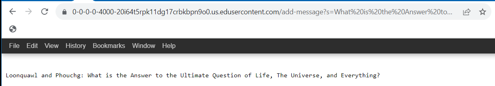
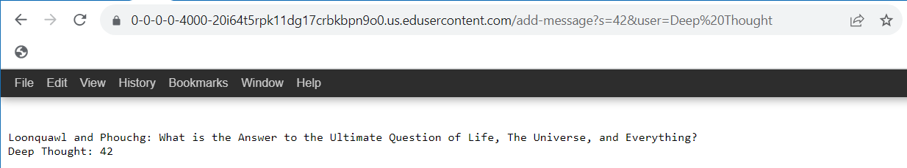

# JC 's Lab Report 2 - Servers and SSH Keys (Week 3)

## Part 1
### * ChatServer code
```
import java.io.IOException;
import java.net.URI;

class Handler implements URLHandler {
   
    String log = "";

    public String handleRequest(URI url) {
        if (url.getPath().equals("/")) {
            return String.format("%s", log);
        } else if (url.getPath().equals("/add-message")) {
            String[] parameters = url.getQuery().split("[= &]");
            log = log + String.format("\n%s: %s", parameters[3], parameters[1]);
    
            
            return String.format("%s", log.replace('+', ' '));

        } else {
            
            return "404 Not Found!";
        }
    }
}

class ChatServer {public static void main(String[] args) throws IOException {
        /*if(args.length == 0){
            System.out.println("Missing port number! Try any number between 1024 to 49151");
            return;
        }

        int port = Integer.parseInt(args[0]); */

        int port = 4000;
        Server.start(port, new Handler());
    }
} 
```
### * 1st screenshot of ChatServer

 
Which methods in your code are called?\
-`Server.start`, `url.getPath`, `url.getQuery.split`, `String.format`, `log.replace`\
What are the relevant arguments to those methods, \
-`Server.start(<int, Handler>)`, `url.getPath(<null>)`, `url.getQuery.spilt(<delimeters>)`, `String.format(<"String", String01, String02>)`, `log.replace(<'oldCHAR', 'newCHAR'>)`\
and the values of any relevant fields of the class?\
-`int port = 4000', `String[] parameters = (<null>)`, `String log = ""` \
How do the values of any relevant fields of the class change from this specific request? If no values got changed, explain why.\
-`parameters[]` now contains `"s", "What is the Answer to the Ultimate Question of Life, The Universe, and Everything?", "user", "Loonquawl and Phouchg"`. `log` has `Loonquawl and Phouchg: What is the Answer to the Ultimate Question of Life, The Universe, and Everything?` appended to it.\
### * 2nd screenshot of ChatServer

 
Which methods in your code are called?\
-`Server.start`, `url.getPath`, `url.getQuery.split`, `String.format`, `log.replace`\
What are the relevant arguments to those methods, \
-`Server.start(<int, Handler>)`, `url.getPath(<null>)`, `url.getQuery.spilt(<delimeters>)`, `String.format(<"String", String01, String02>)`, `log.replace(<'oldCHAR', 'newCHAR'>)`\
and the values of any relevant fields of the class?\
-`int port = 4000', `String[] parameters = (<null>)`, `String log = "Loonquawl and Phouchg: What is the Answer to the Ultimate Question of Life, The Universe, and Everything?"`\
How do the values of any relevant fields of the class change from this specific request? If no values got changed, explain why.\
-`parameters[]` now contains `"s", "42", "user", "Deep Thought"`. `log` has `Deep Thought: 42` appended to it.
      
## Part 2
### * The absolute path to the private key for my SSH key for logging into `ieng6`
 
### * The absolute path to the public key for my SSH key for logging into `ieng6`
 
### * A terminal interaction where I log into my `ieng6` account without being asked for a password.
 

## Part 3
### * In a couple of sentences, describe something you learned from lab in week 2 or 3 that you didn't know before.
I learned a little bit about using `curl` to launch urls from the command line. It stand for "Cluent for URL" and is not limited to JAVA. It is a separate command-line tool that is used transferring data using various network protocols.
