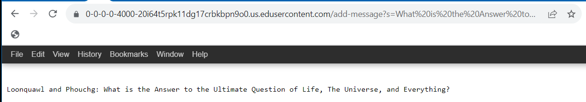
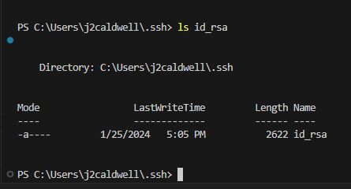
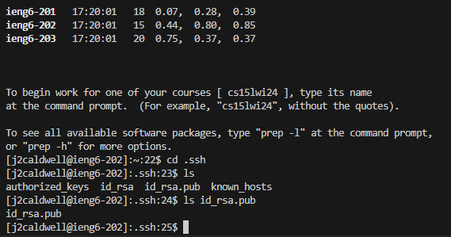
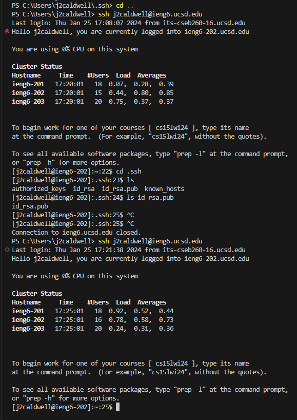

# JC 's Lab Report 2 - Servers and SSH Keys (Week 3)

## Part 1
### * ChatServer code
```
import java.io.IOException;
import java.net.URI;

class Handler implements URLHandler {
   
    String log = "";

    public String handleRequest(URI url) {
        if (url.getPath().equals("/")) {
            return String.format("%s", log);
        } else if (url.getPath().equals("/add-message")) {
            String[] parameters = url.getQuery().split("[= &]");
            log = log + String.format("\n%s: %s", parameters[3], parameters[1]);
    
            
            return String.format("%s", log.replace('+', ' '));

        } else {
            
            return "404 Not Found!";
        }
    }
}

class ChatServer {
    public static void main(String[] args) throws IOException {
        /*if(args.length == 0){
            System.out.println("Missing port number! Try any number between 1024 to 49151");
            return;
        }

        int port = Integer.parseInt(args[0]); */

        int port = 4000;
        Server.start(port, new Handler());
    }
} 
```
### * 1st screenshot of ChatServer

 
- working directory: `/home`
- we were navigated to the directory that was entered as an argument.
- no error.
### * 2nd screenshot of ChatServer

 
  - Which methods in your code are called?
  - What are the relevant arguments to those methods, and the values of any relevant fields of the class?
  - How do the values of any relevant fields of the class change from this specific request? If no values got changed, explain why.
      
## Part 2
### * The absolute path to the private key for my SSH key for logging into `ieng6`
 
### * The absolute path to the public key for my SSH key for logging into `ieng6`
 
### * A terminal interaction where I log into my `ieng6` account without being asked for a password.
 

## Part 3
### * In a couple of sentences, describe something you learned from lab in week 2 or 3 that you didn't know before.
Answer
  - contents of the file were printed to the screen
  - No error.
